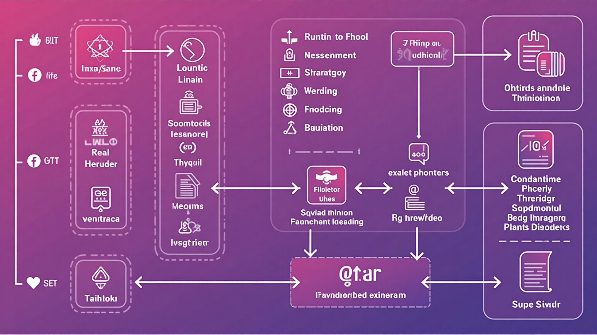

# LoveMatch Thailand 💕

LoveMatch Thailand is a modern, Thai-focused dating web application that leverages social media integration, short video profiles, and AI-assisted matching to connect users. Built with React, TypeScript, and Supabase, it provides an engaging dating platform with a beautiful pink gradient design.

   

## 🌟 Features

- **📱 Modern Dating Experience**: Tinder-style swipe interface with smooth animations
- **🎥 Video Profiles**: Support for video introductions and profile enhancement
- **🤖 AI-Powered Matching**: Intelligent compatibility scoring based on interests and preferences
- **💬 Secure Messaging**: End-to-end encrypted messaging between matched users
- **📲 Social Media Integration**: Connect with Facebook, TikTok, Instagram, and Twitter
- **💎 Freemium Model**: Free tier with premium features and in-app purchases
- **🇹🇭 Thai-Focused**: Designed specifically for the Thai dating market

## 🚀 Quick Start

```bash
# Clone the repository
git clone <YOUR_GIT_URL>
cd <YOUR_PROJECT_NAME>

# Install dependencies
npm install

# Set up environment (copy .env.example to .env.local)
cp .env.example .env.local

# Start development server
npm run dev
```

## 📚 Documentation

- 📁 [**File Structure Guide**](filesExplainer.md) - Complete project structure breakdown
- 🛠️ [**Scripts Documentation**](scripts.md) - All NPM scripts explained
- 🏗️ [**Architecture Analysis**](structure-analysis.md) - Structure recommendations and migration guide
- 🤝 [**Contributing Guide**](.github/CONTRIBUTING.md) - How to contribute to the project
- 🔧 [**Environment Setup**](.env.example) - Environment variables template

## 🏗️ Architecture



## 🛠️ Technologies

- **Frontend**: Vite, React, TypeScript, Tailwind CSS
- **Backend**: Supabase (PostgreSQL + Auth)
- **UI Components**: Shadcn/ui
- **Styling**: Custom design system with pink gradient theme
- **Authentication**: Supabase Auth with social media login
- **Real-time**: Supabase real-time subscriptions

## 📄 License

This project is built with [Lovable](https://lovable.dev) and is available for editing at:
**URL**: https://lovable.dev/projects/e181b21c-ce6e-4928-acb2-c1f2802ec3d7
